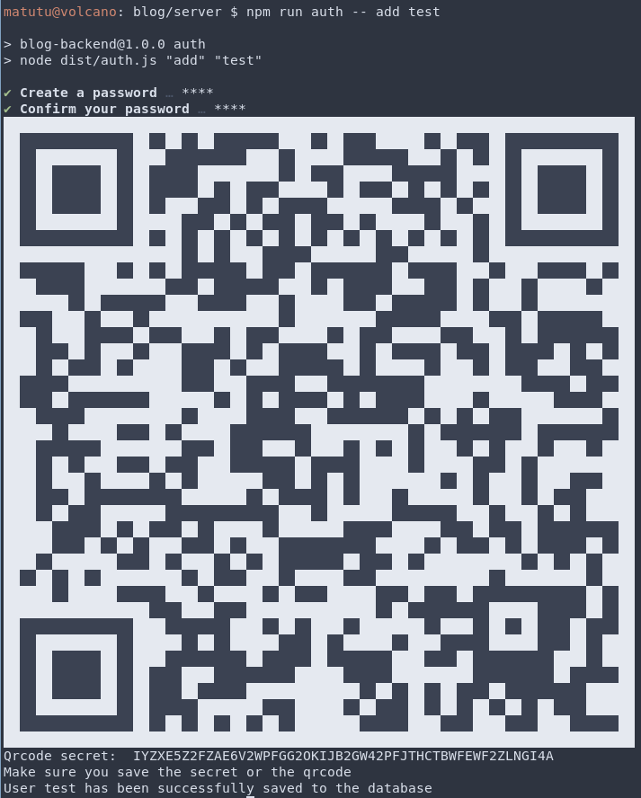

# blog-backend
Blog backend build with NodeJs, Redis, TypeORM with PostgreSQL and Apollo Server.

[Frontend](https://github.com/mDeram/blog-frontend)

## Requirements
- PostgreSQL (or an other DB supported by TypeORM), configured in src/typeorm.config.ts
- Redis

## Running the project in development
```sh
npm run watch # Transpile typescript
npm run dev # Start the server on port 3000 by default
```
You can visit the graphql playground at:
`localhost:3000/graphql`

## Running the project in production
```sh
npm run build
npm run start
```

## Migrations
For migrations you need to configure ormconfig.json and set it to a different database than src/typeorm.config.ts
since by default TypeORM will synchronize the database with entities.
```sh
npm run migration:generate -- MigrationName
npm run migration:run
```

## Environment variables
1. Copy .env.example to .env
2. Set all variables corresponding to the following descriptions:

Your database password:

`DB_PASS`

Server port:

`PORT`

Frontend url (used for CORS):

`FRONT_URL`

Your cookies secret key:

`COOKIE_SECRET`

The same token used for the blog-frontend REVALIDATE_TOKEN environment variable:

`REVALIDATE_TOKEN`

The url to revalidate pages located at domain.com/FrontendbaseUrl/api/revalidate,
or located at localhost:FrontendPort/FrontendbaseUrl/api/revalidate

`REVALIDATE_URL`

## Creating admin account
1. Run the command bellow.
2. Follow the prompt.
3. Use a 2FA app (like google authenticator) to scan the QR-code or enter the secret manually
4. You can use your username, password and 2FA token to login in domain.com/FrontendbasePath/blog/editor/login
```sh
npm run auth -- add <username>
```



### Other auth commands
```sh
npm run auth -- ls              # list all admin users
npm run auth -- add <username>  # add user
npm run auth -- rm  <username>  # remove user
npm run auth -- flush           # remove all users
